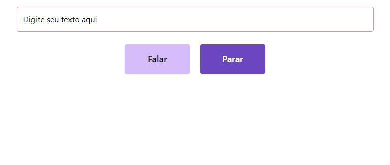

<h1 align="center">
    Speech Text 🤖
</h1>

<h3 align=center>

</h3>

<h3 align="center">
    O Speech Text é um pequeno projeto criado a partir do Code/Drops #60 com Professor Mayk Brito que utiliza a síntese de voz para ler textos por nós 😊
</h3>

<h4 align="center">
    <a href="https://azanniel.github.io/speech-engine/">Clique aqui para utilizar</a>
</h4>

 

## **💻 TECNOLOGIAS**

- **HTML**
- **JavaScript**
- **[Tailwind](https://tailwindcss.com/)**

 

## **🤩 AGRADECIMENTOS E REFERÊNCIA**

<h2 align="center">
    
Mayk Brito

    
     
    <a href="https://www.youtube.com/watch?v=XlNLjG2c9uM">Code/Drops #60</a>
</h2>

 

## **📃 LICENÇA**

Esse repositório está licenciado pela **MIT LICENSE**. Para mais informações detalhadas, leia o arquivo [LICENSE](./LICENSE) contido nesse repositório.